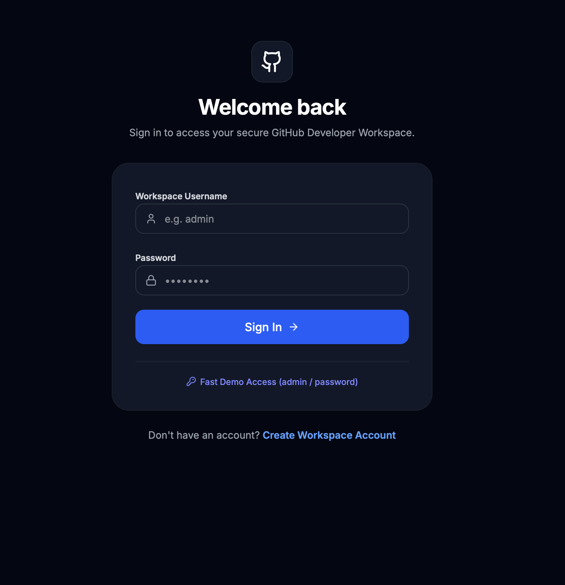
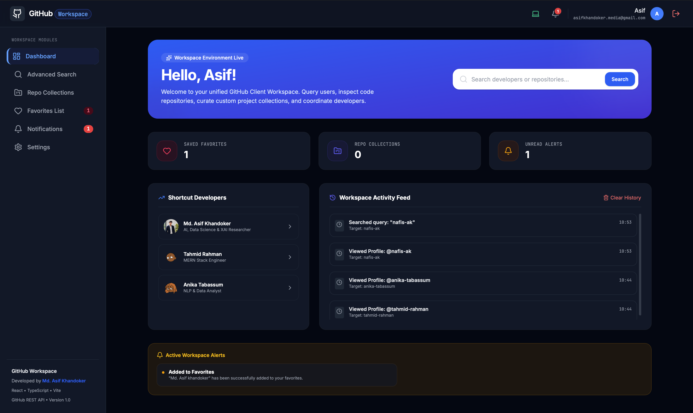
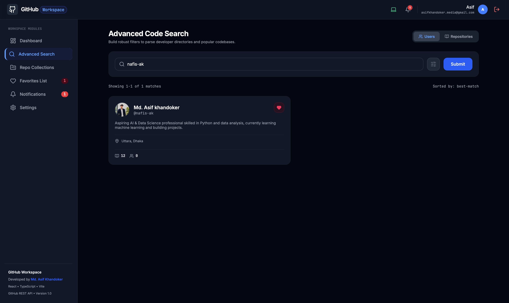
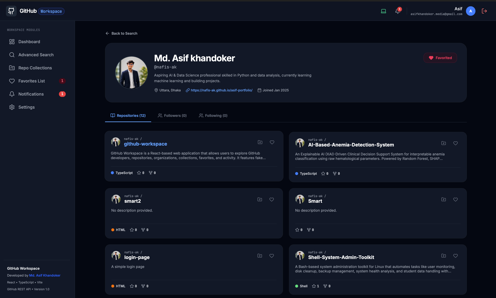
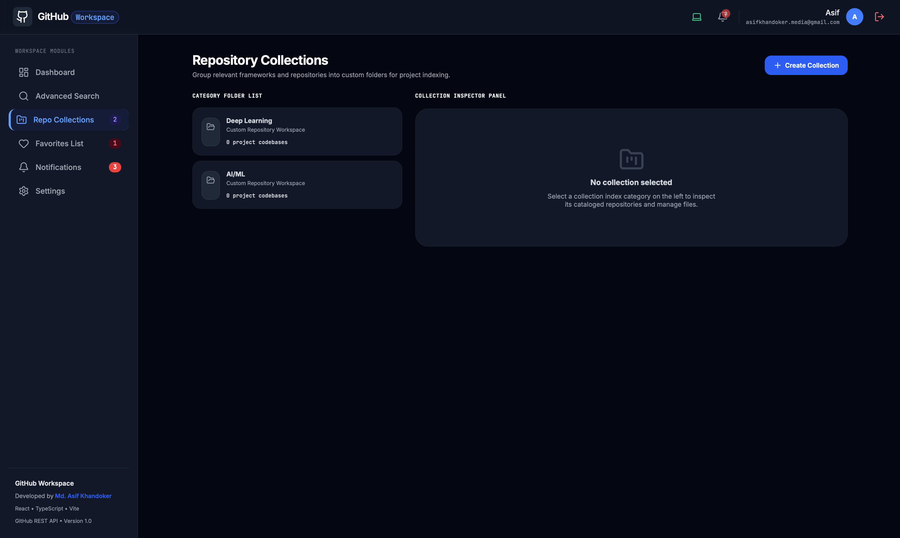
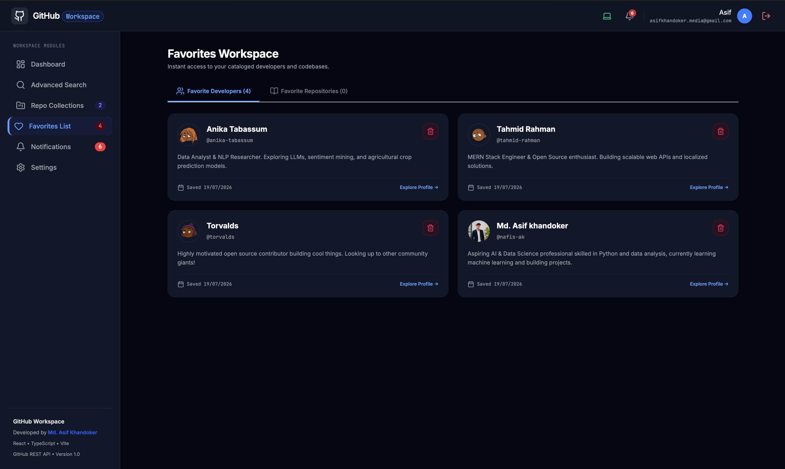
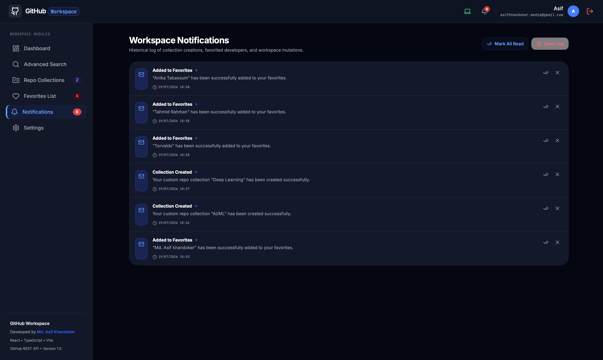
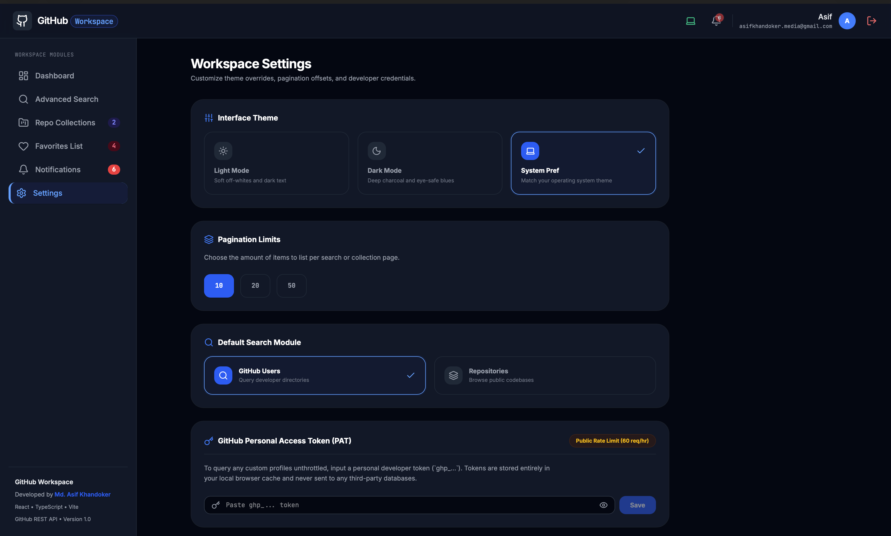
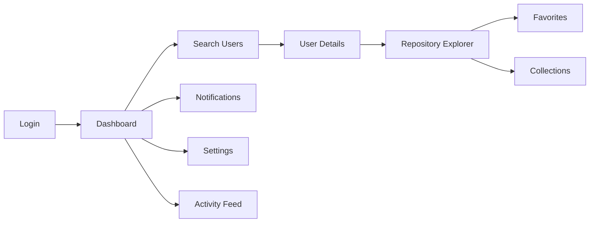
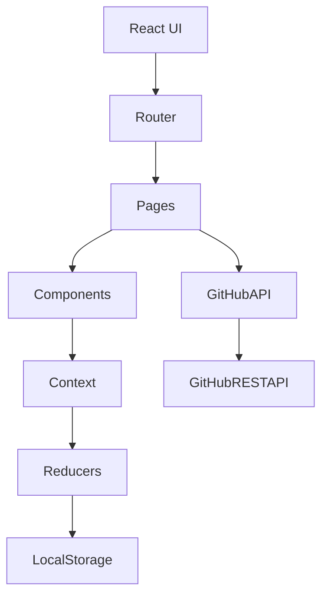

<div align="center">

# 🚀 GitHub Workspace

### A Modern React-Based GitHub Explorer & Repository Management Platform


## 🌐 Live Demo

Experience the application live:

👉 **https://github-workspace-psi.vercel.app**

### ⭐ A Complete GitHub Client Built with Modern React

</div>

---

# 📖 Project Overview

GitHub Workspace is a modern React-based web application that allows users to explore GitHub developers, repositories, organizations, favorites, collections, notifications, and activities through the official GitHub REST API.

The project simulates a lightweight GitHub client by combining authentication, repository management, user search, personalized collections, favorites, notification handling, and customizable settings into a single responsive interface.

The application was developed following a modular architecture to demonstrate modern React development practices including Context API, React Router, reusable components, custom hooks, state persistence, protected routes, and API integration.

---

# 🎯 Project Objectives

✔ Build a complete React application using modern best practices

✔ Learn API integration using GitHub REST API

✔ Implement authentication with protected routes

✔ Manage global state using Context API & Reducers

✔ Create reusable and scalable React components

✔ Apply advanced routing techniques

✔ Practice custom hooks and persistent storage

✔ Build a responsive user-friendly interface

---

# ✨ Key Features

- 🔐 Fake Authentication System
- 👤 GitHub User Search
- 📄 User Profile Details
- 📂 Repository Explorer
- 📚 Repository Collections
- ⭐ Favorites Management
- 🔔 Notification Center
- 📈 Activity Feed
- 🎯 Advanced Search Filters
- ⚙ User Settings
- 🌙 Theme Support
- 📱 Responsive Design
- ⚡ GitHub REST API Integration

---

# 📑 Table of Contents

- Project Overview
- Project Objectives
- Key Features
- Technology Stack
- Project Structure
- Installation
- Running the Project
- Application Screenshots
- Module Overview
- React Concepts
- API Integration
- Future Improvements
- Developer

---

# 🛠 Technology Stack

| Category | Technology |
|-----------|------------|
| Frontend | React 19 |
| Language | TypeScript |
| Build Tool | Vite |
| Routing | React Router |
| State Management | Context API |
| Reducer | useReducer |
| Styling | CSS |
| Icons | Lucide React |
| API | GitHub REST API |
| Storage | LocalStorage |
| Version Control | Git & GitHub |

---

# 📂 Project Structure

```text
src
│
├── app
│
├── routes
│
├── pages
│   ├── Dashboard
│   ├── Search
│   ├── UserDetails
│   ├── RepositoryDetails
│   ├── Favorites
│   ├── Collections
│   ├── Notifications
│   └── Settings
│
├── components
│   ├── common
│   ├── users
│   ├── repositories
│   └── layout
│
├── hooks
│
├── context
│
├── reducers
│
├── services
│   └── githubApi.ts
│
├── utils
│
└── types
```

---

# ⚙ Installation

Clone the repository

```bash
git clone https://github.com/nafis-ak/github-workspace.git
```

Navigate to the project

```bash
cd github-workspace
```

Install dependencies

```bash
npm install
```

Start Development Server

```bash
npm run dev
```

Open Browser

```
http://localhost:5173
```

---

# 📸 Application Preview

| Login | Dashboard |
|--------|-----------|
|  |  |

| User Search | User Profile |
|-------------|--------------|
|  |  |

| Repository Explorer | Favorites |
|---------------------|-----------|
|  |  |

| Collections | Notifications |
|-------------|---------------|
|  |  |

| Settings |
|----------|
|  |

---

# 🧩 Project Modules

The application follows a modular architecture where each module focuses on a specific React concept while integrating with the GitHub REST API.

---

## 📌 Module Overview

| Module | Feature | Route | React Concepts | Status |
|---------|---------|-------|----------------|:------:|
| Module 1 | Authentication | `/login` `/register` `/dashboard` | Context API, Forms, Validation, LocalStorage | ✅ |
| Module 2 | User Search | `/search` | API Calls, Debouncing, Loading States | ✅ |
| Module 3 | User Details | `/users/:username` | Dynamic Routes, Nested Routes, Data Fetching | ✅ |
| Module 4 | Repository Explorer | `/repos/:owner/:repo` | Route Parameters, Tabs, Reusable Components | ✅ |
| Module 5 | Repository Collections | `/collections` | CRUD, Context API, State Management | ✅ |
| Module 6 | Favorites | `/favorites` | Reducers, Context API, Persistent State | ✅ |
| Module 7 | Advanced Search | `/search` | Query Parameters, URL Sync | ✅ |
| Module 8 | Activity Feed | Dashboard | LocalStorage, Side Effects | ✅ |
| Module 9 | Notifications | `/notifications` | Reducers, Global State | ✅ |
| Module 10 | Settings | `/settings` | Theme, Preferences, Persistence | ✅ |

---

# 🔐 Module 1 — Authentication Layer

The application provides a simulated authentication system to create a realistic user experience without requiring GitHub OAuth.

### Features

- Login Page
- Register Page
- Protected Routes
- Session Persistence
- LocalStorage Authentication
- Form Validation

### React Concepts

- React Forms
- Context API
- LocalStorage
- React Router
- Protected Routes

---

# 🔎 Module 2 — GitHub User Search

Users can search any public GitHub account using the GitHub REST API.

### Search Examples

- torvalds
- gaearon
- yyx990803

### Displays

- Avatar
- Username
- Name
- Followers
- Following
- Public Repositories

### API

```
GET /users/{username}
```

### Concepts

- Axios
- Async API Calls
- Debouncing
- Loading Spinner
- Error Handling

---

# 👤 Module 3 — User Details

Each searched developer has a dedicated profile page.

### Route

```
/users/:username
```

### Sections

- Profile
- Avatar
- Bio
- Company
- Location
- Website
- Followers
- Following
- Repository List

### Concepts

- Dynamic Routing
- Nested Routing
- API Fetching
- Reusable Components

---

# 📂 Module 4 — Repository Explorer

Repository Explorer displays detailed information about any GitHub repository.

### Route

```
/repos/:owner/:repo
```

### Information

- Repository Name
- Description
- Stars
- Forks
- Issues
- Programming Language
- Contributors
- Branches
- Commits

### React Concepts

- Route Parameters
- Tab Navigation
- Component Reusability

---

# 📚 Module 5 — Repository Collections

Users can organize repositories into custom collections.

### Examples

- Frontend Projects
- Machine Learning
- Favorite Projects
- Portfolio Inspiration

### Features

- Create Collection
- Edit Collection
- Delete Collection
- Local Persistence

### React Concepts

- CRUD Operations
- Context API
- State Management

---

# ⭐ Module 6 — Favorites

Users can save important developers and repositories.

### Features

- Favorite Developers
- Favorite Repositories
- Remove Favorites
- Persistent Storage

### Route

```
/favorites
```

### Concepts

- useReducer
- Context API
- LocalStorage

---

# 🎯 Module 7 — Advanced Search

Advanced search provides additional filtering capabilities.

### Filters

- Language
- Stars
- Forks
- Updated Date

### Example

```
/search?language=javascript&stars=1000
```

### Concepts

- URL Parameters
- Query Strings
- URL Synchronization

---

# 📈 Module 8 — Activity Feed

Tracks recent user interactions.

### Stores

- Recently Viewed Users
- Recently Viewed Repositories
- Search History

### Storage

```
LocalStorage
```

### Concepts

- Side Effects
- State Persistence
- Custom Hooks

---

# 🔔 Module 9 — Notification Center

Displays application notifications generated during user interactions.

### Notifications

- Repository Added
- Collection Created
- Profile Viewed
- Search Completed

### Notification Object

```javascript
{
  id,
  title,
  message,
  isRead,
  createdAt
}
```

### Route

```
/notifications
```

### Concepts

- Global State
- Reducers
- Context API

---

# ⚙ Module 10 — Settings

Allows users to personalize their workspace.

### Route

```
/settings
```

### Features

- Theme Selection
- Light Theme
- Dark Theme
- System Theme
- Pagination Size
- Default Search Type

### Concepts

- Preferences
- Local Persistence
- Context API

---

# ⚛ React Concepts Implemented

| Category | Implemented |
|-----------|-------------|
| Components | ✅ |
| Reusable Cards | ✅ |
| Navbar | ✅ |
| Sidebar | ✅ |
| Tables | ✅ |
| Pagination | ✅ |
| Tabs | ✅ |
| Modals | ✅ |
| Forms | ✅ |

---

# 🎣 React Hooks Used

| Hook | Purpose |
|------|----------|
| useState | Component State |
| useEffect | Side Effects |
| useMemo | Performance Optimization |
| useCallback | Function Memoization |
| useReducer | Global State |
| useContext | Context Management |

---

# 🪝 Custom Hooks

| Hook | Description |
|------|-------------|
| useFetch() | API Data Fetching |
| useDebounce() | Search Optimization |
| useLocalStorage() | Persistent Storage |
| usePagination() | Pagination Logic |
| useTheme() | Theme Management |

---

# 🛣 Routing Strategy

| Feature | Status |
|----------|:------:|
| React Router | ✅ |
| Protected Routes | ✅ |
| Nested Routes | ✅ |
| Dynamic Routes | ✅ |
| Query Parameters | ✅ |

---

# 🗂 State Management

The application follows a lightweight yet scalable state management architecture using React Context API and Reducers.

- Context API
- useReducer
- LocalStorage Persistence
- Global Theme
- Authentication Context
- Favorites Context
- Notification Context

---

# 🌐 GitHub REST API

The project communicates with GitHub's official REST API.

| Endpoint | Purpose |
|-----------|----------|
| GET /users/{username} | User Details |
| GET /users/{username}/repos | Repository List |
| GET /repos/{owner}/{repo} | Repository Details |
| GET /repos/{owner}/{repo}/contributors | Contributors |
| GET /users/{username}/followers | Followers |
| GET /users/{username}/following | Following |

---

# 🔄 Application Workflow



---

# 🏗 Application Architecture



---

# 📊 Feature Matrix

| Feature | Status |
|:--------:|:------:|
| 🔐 Authentication | ✅ Completed |
| 👤 User Search | ✅ Completed |
| 📄 User Details | ✅ Completed |
| 📂 Repository Explorer | ✅ Completed |
| 📚 Repository Collections | ✅ Completed |
| ⭐ Favorites | ✅ Completed |
| 🎯 Advanced Search | ✅ Completed |
| 📈 Activity Feed | ✅ Completed |
| 🔔 Notification Center | ✅ Completed |
| ⚙ Settings | ✅ Completed |
| 🌙 Theme Support | ✅ Completed |
| 💾 Local Storage Persistence | ✅ Completed |
| 📱 Responsive Layout | ✅ Completed |
| 🔄 Dynamic Routing | ✅ Completed |
| 🌐 GitHub REST API Integration | ✅ Completed |

---

# 🚀 Performance Highlights

✔ Fast Page Navigation

✔ Responsive User Interface

✔ Optimized API Requests

✔ Persistent User Preferences

✔ Modular Folder Structure

✔ Reusable Components

✔ Scalable Architecture

✔ Clean Code Organization

✔ Context API State Management

✔ GitHub REST API Integration

---

# 🎯 Learning Outcomes

This project demonstrates practical implementation of:

- React Components
- Component Reusability
- React Router
- Protected Routes
- Dynamic Routing
- Nested Routing
- Context API
- Reducers
- LocalStorage
- API Integration
- Async Programming
- Error Handling
- Loading States
- Debouncing
- Custom Hooks
- Global State Management
- Responsive UI Design
- Modern React Architecture

---

# 📸 Screens Included

The repository includes screenshots for the following application pages:

| Screen | Preview |
|---------|---------|
| Login | ✅ |
| Dashboard | ✅ |
| Search Users | ✅ |
| User Details | ✅ |
| Repository Explorer | ✅ |
| Favorites | ✅ |
| Collections | ✅ |
| Notifications | ✅ |
| Settings | ✅ |

---

# 🔮 Future Improvements

Some features planned for future versions:

- GitHub OAuth Authentication
- Repository Star & Unstar
- Repository Watch Support
- GitHub Gists
- Repository Analytics
- Organization Dashboard
- Infinite Scrolling
- Export Collections
- Search Suggestions
- Offline Cache
- Unit Testing
- Docker Deployment
- CI/CD Pipeline
- PWA Support

---

# 🤝 Contributing

Contributions are welcome.

If you would like to improve this project:

1. Fork the repository
2. Create a new feature branch

```bash
git checkout -b feature/new-feature
```

3. Commit your changes

```bash
git commit -m "Add new feature"
```

4. Push your branch

```bash
git push origin feature/new-feature
```

5. Open a Pull Request

---

# 📄 License

This project was developed for educational and learning purposes.

You are welcome to explore, learn from, and modify the source code for personal or academic use.

---

# 👨‍💻 Developer

<div align="center">

## Md. Asif Khandoker

**B.Sc. in Computer Science & Engineering**

**Daffodil International University**

---

### Connect with Me

<p>

<a href="https://github.com/nafis-ak">

</a>

</p>

</div>

---

# 💙 Acknowledgements

Special thanks to:

- GitHub REST API
- React Team
- Vite
- TypeScript
- Open Source Community

---

# ⭐ Repository Support

If you found this project helpful,

please consider giving it a ⭐ on GitHub.

It helps motivate future development and improvements.

---

<div align="center">

# 🚀 GitHub Workspace

### Explore • Organize • Discover

Built with ❤️ using **React**, **TypeScript**, **Vite**, and the **GitHub REST API**.


</div>
